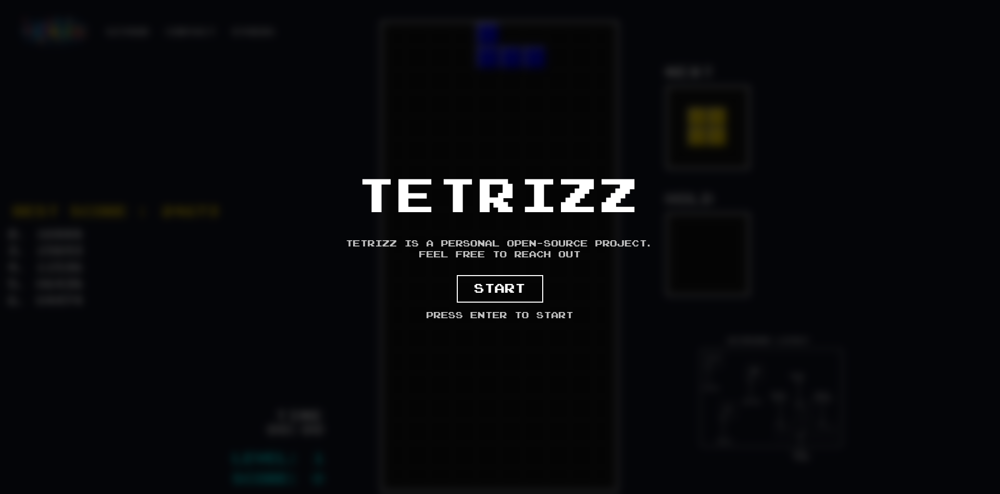
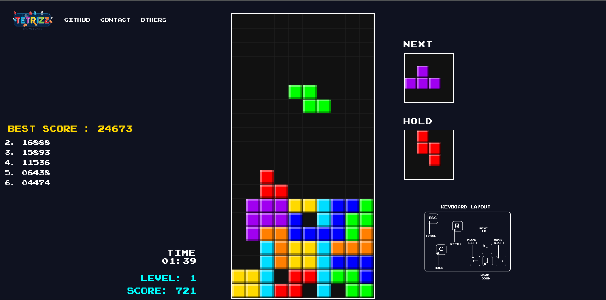
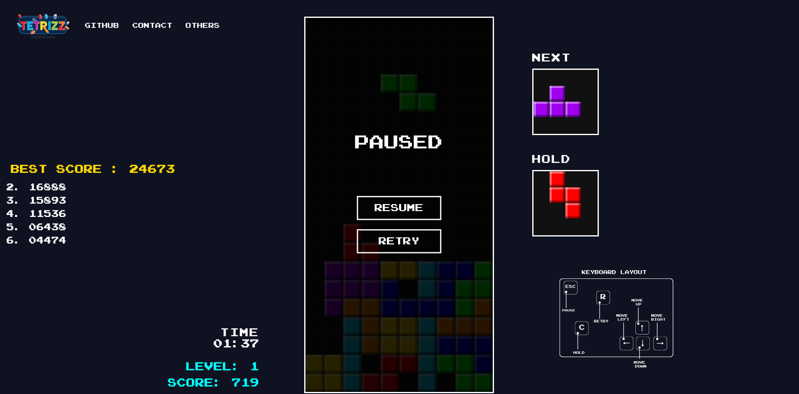
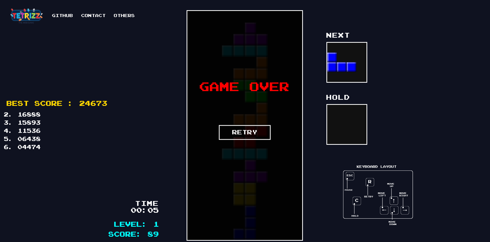

  

<h1 align="center">TETRIZZ</h1>

  A modern, arcade-style Tetris clone built with pure JavaScript and HTML5 Canvas.

  
  
  

---

## 🎯 Project Purpose

TETRIZZ was created as an open-source learning project with a clear objective:

- To serve as a practical guide for developers who want to understand how HTML5 Canvas works in real-world game development.
- To demonstrate how powerful **pure HTML and Vanilla JavaScript** can be without relying on external frameworks or game engines.
- To improve my own software engineering skills by building a complete modular game architecture from scratch.
- To design a clean, maintainable, and expandable codebase that others can study and learn from.

This project intentionally avoids libraries and focuses entirely on low-level rendering, state management, and game logic.

---

## 🎮 Demo

> 🔗 Live version: https://www.tettrizz.com/

---

## 🖼 Preview

### 🏠 Main Screen

### 🎯 Gameplay

### ⏸ Pause Menu

### 💀 Game Over

> 📁 Put your screenshots inside: `docs/images/`

---

## ✨ Features

- 🎨 Custom block shading (3D highlight & shadow effect)
- 🧠 Hold system (C key)
- ⏭ Next piece preview
- ⚡ Level-based dynamic speed system
- 💾 Score system with localStorage
- ⏱ Real-time timer
- 🖱 Interactive canvas-based pause & retry buttons
- 🎮 Arcade-style UI
- 🧩 Fully modular architecture

---

## 🎹 Controls

| Key | Action |
|------|--------|
| ⬅️ ➡️ | Move |
| ⬆️ | Rotate |
| ⬇️ | Soft drop |
| C | Hold piece |
| ESC | Pause |
| R | Retry (Game Over) |
| ENTER | Start game |

---

## 🏗 Architecture

The project is fully modular and organized by responsibility:

